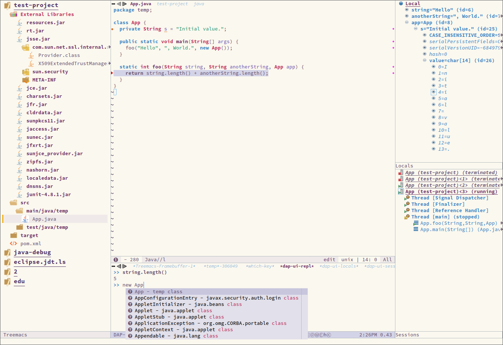

[](https://melpa.org/#/lsp-java)
[](https://travis-ci.com/emacs-lsp/lsp-java)

Java support for lsp-mode using the [Eclipse JDT Language Server](https://projects.eclipse.org/projects/eclipse.jdt.ls).

## Features
LSP java mode supports the following JDT Features:
* As you type reporting of parsing and compilation errors (via [flycheck](https://github.com/flycheck/flycheck)/[lsp-ui](https://github.com/emacs-lsp/lsp-ui))
* Code completion - using [company-lsp](https://github.com/tigersoldier/company-lsp) or builtin ```complete-at-point```
* Javadoc hovers - using [lsp-ui](https://github.com/emacs-lsp/lsp-ui)
* Code actions - using [lsp-ui](https://github.com/emacs-lsp/lsp-ui)
* Code outline - using builtin [imenu](https://www.gnu.org/software/emacs/manual/html_node/emacs/Imenu.html)
* Code navigation - using builtin [xref](https://www.gnu.org/software/emacs/manual/html_node/emacs/Xref.html)
* Code lens (references/implementations) - using builtin [xref](https://www.gnu.org/software/emacs/manual/html_node/emacs/Xref.html)
* Highlights
* Code formatting
* Maven pom.xml project support
* Limited Gradle support

## Installation
### Install LSP Java
The recommended way to install LSP Java is via `package.el` - the built-in package
manager in Emacs.
LSP Java is available on the two major `package.el` community
maintained repos -
[MELPA Stable](http://stable.melpa.org)
and [MELPA](http://melpa.org).

<kbd>M-x</kbd> `package-install` <kbd>[RET]</kbd> `lsp-java` <kbd>[RET]</kbd>

Then add the following lines to your `.emacs` and open a file from the any of the specified projects.
```emacs-lisp
(require 'lsp-java)
(add-hook 'java-mode-hook #'lsp-java-enable)

;; set the projects that are going to be imported into the workspace.
(setq lsp-java--workspace-folders (list "/path/to/project1"
                                        "/path/to/project2"
                                        ...))
```

### Install [Eclipse JDT Language Server](https://projects.eclipse.org/projects/eclipse.jdt.ls)
Download either [latest](http://download.eclipse.org/jdtls/snapshots/jdt-language-server-latest.tar.gz) or [a specific version](http://download.eclipse.org/jdtls/snapshots/?d) of Eclipse JDT Language Server distribution to `~/.emacs.d/eclipse.jdt.ls/server/`

If you choose to have the server installed in a different directory, set `lsp-java-server-install-dir`

## Screenshot

## Additional packages
* [lsp-ui](https://github.com/emacs-lsp/lsp-ui) : Flycheck, documentation and code actions support.
* [company-lsp](https://github.com/tigersoldier/company-lsp) : LSP company backend.
## FAQ
* LSP Java is showing to many debug messages, how to stop that?

Add the following configuration.
```emacs-lisp
(setq lsp-inhibit-message t)
```
* [lsp-ui](https://github.com/emacs-lsp/lsp-ui) does not display all of the actions on the current point(e. g "Extract constant")?

LSP UI by default sends current line bounds for action region which breaks forces JDT server to return only "Extract method action."
```emacs-lisp
(setq lsp-ui-sideline-update-mode 'point)
```
* LSP Java does not provide completion, go to definition for some of the files?

Make sure the project is properly imported according to instructions. When particular file is not part of imported project [Eclipse JDT Language Server](https://projects.eclipse.org/projects/eclipse.jdt.ls) could not calculate the current classpath.
